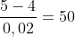
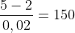
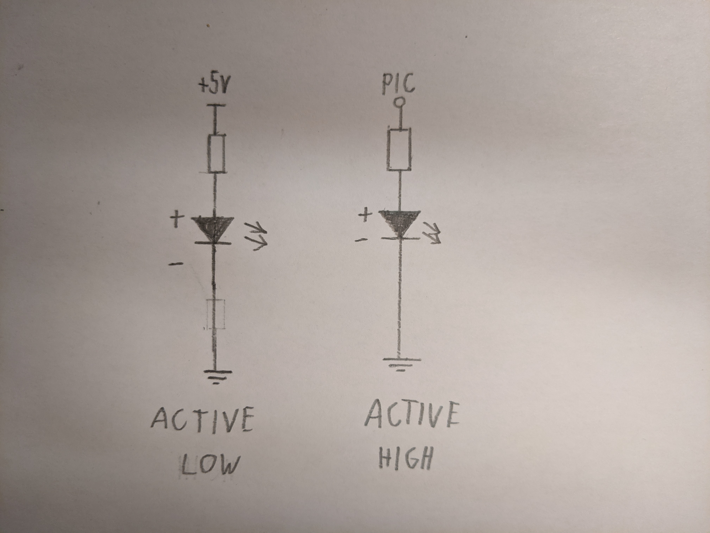
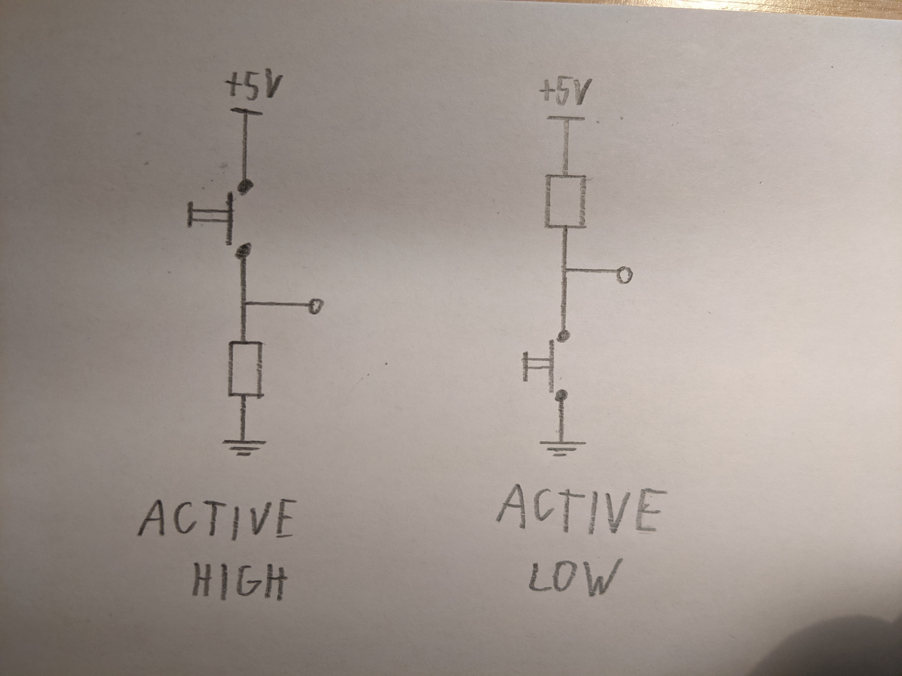

# Preperation Task

### Table
LED color | Supply voltage | LED current | LED current | Resistor value
------------ | -------------| -------------| -------------| ------------- |
red | 5V | 20 mA | 2V | 150 Ω | 
blue | 5V | 20 mA | 4V | 50 Ω | 
1

