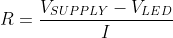

# Preperation Task

## 1. Draw two basic ways to connect a LED to the output pin of the microcontroller: LED active-low, LED active-high.

## 2. Calculate LED resistor value for typical red and blue LEDs.
 

## 3. Draw the basic ways to connect a push button to the microcontroller input pin: button active-low, button active-high.

### Table
LED color | Supply voltage | LED current | LED current | Resistor value
------------ | -------------| -------------| -------------| ------------- |
red | 5V | 20 mA | 2V | 150 Ω | 
blue | 5V | 20 mA | 4V | 50 Ω | 

