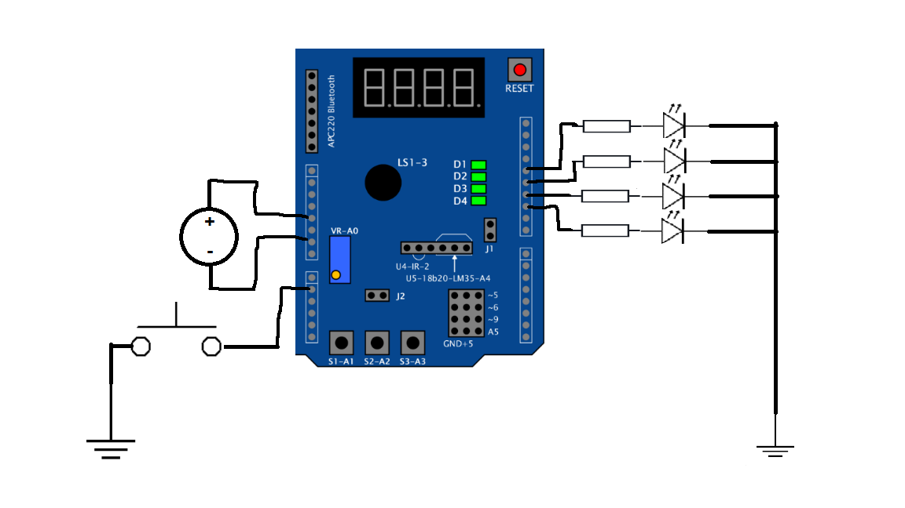

# Lab 4: Samuel Turák

Link to your `Digital-electronics-2` GitHub repository:

   https://github.com/Samuelturak/Digital-Electronic-2


### Overflow times

1. Complete table with overflow times.

| **Module** | **Number of bits** | **1** | **8** | **32** | **64** | **128** | **256** | **1024** |
| :-: | :-: | :-: | :-: | :-: | :-: | :-: | :-: | :-: |
| Timer/Counter0 | 8  | 16u | 128u | -- | 1024u | -- | 4096u | 16384u |
| Timer/Counter1 | 16 | 4096u | 32768u | -- | 262144u | -- | 1048576u | 4194304u |
| Timer/Counter2 | 8  |  16u   | 128u | 512u | 1024u | 2048u | 4096u | 16384u |

| **Module** | **Operation** | **I/O register(s)** | **Bit(s)** |
| :-: | :-- | :-: | :-- |
| Timer/Counter0 | Prescaler<br><br>8-bit data value<br>Overflow interrupt enable | <br><br><br> | CS02, CS01, CS00<br>(000: stopped, 001: 1, 010: 8, 011: 64, 100: 256, 101: 1024)<br>TCNT1[15:0]<br>TOIE1 (1: enable, 0: disable)  |
| Timer/Counter1 | Prescaler<br><br>16-bit data value<br>Overflow interrupt enable | TCCR1B<br><br>TCNT1H, TCNT1L<br>TIMSK1 | CS12, CS11, CS10<br>(000: stopped, 001: 1, 010: 8, 011: 64, 100: 256, 101: 1024)<br>TCNT1[15:0]<br>TOIE1 (1: enable, 0: disable) |
| Timer/Counter2 | Prescaler<br><br>8-bit data value<br>Overflow interrupt enable | <br><br><br> | <br><br><br> |

### Timer library

1. In your words, describe the difference between common C function and interrupt service routine.
   * Function is being called up by the code. It is stated when its being called up.
   * Interrupt service routine occurs during an interrupt of the microprocessor, not by an instruction. An interrupt occurs by an internal or an external signal.

2. Part of the header file listing with syntax highlighting, which defines settings for Timer/Counter0:

```c
/**
 * @name  Definitions of Timer/Counter0
 * @note  F_CPU = 16 MHz
 */
/** @brief Stop timer, prescaler 000 --> STOP */
#define TIM0_stop()           TCCR0B &= ~((1<<CS02) | (1<<CS01) | (1<<CS00));
/** @brief Set overflow 4ms, prescaler 001 --> 1 */
#define TIM0_overflow_4ms()   TCCR0B &= ~((1<<CS02) | (1<<CS01)); TCCR0B |= (1<<CS00);
/** @brief Set overflow 33ms, prescaler 010 --> 8 */
#define TIM0_overflow_33ms()  TCCR0B &= ~((1<<CS02) | (1<<CS00)); TCCR0B |= (1<<CS01);
/** @brief Set overflow 262ms, prescaler 011 --> 64 */
#define TIM0_overflow_262ms() TCCR0B &= ~(1<<CS02); TCCR0B |= (1<<CS01) | (1<<CS00);
/** @brief Set overflow 1s, prescaler 100 --> 256 */
#define TIM0_overflow_1s()    TCCR0B &= ~((1<<CS01) | (1<<CS00)); TCCR0B |= (1<<CS02);
/** @brief Set overflow 4s, prescaler // 101 --> 1024 */
#define TIM0_overflow_4s()    TCCR0B &= ~(1<<CS01); TCCR0B |= (1<<CS02) | (1<<CS00);
/** @brief Enable overflow interrupt, 1 --> enable */
#define TIM0_overflow_interrupt_enable()  TIMSK0 |= (1<<TOIE0);
/** @brief Disable overflow interrupt, 0 --> disable */
#define TIM0_overflow_interrupt_disable() TIMSK0 &= ~(1<<TOIE0);

```

3. Flowchart figure for function `main()` and interrupt service routine `ISR(TIMER1_OVF_vect)` of application that ensures the flashing of one LED in the timer interruption. When the button is pressed, the blinking is faster, when the button is released, it is slower. Use only a timer overflow and not a delay library. The image can be drawn on a computer or by hand. Use clear descriptions of the individual steps of the algorithms.

   


### Knight Rider

1. Scheme of Knight Rider application with four LEDs and a push button, connected according to Multi-function shield. Connect AVR device, LEDs, resistors, push button, and supply voltage. The image can be drawn on a computer or by hand. Always name all components and their values.

   